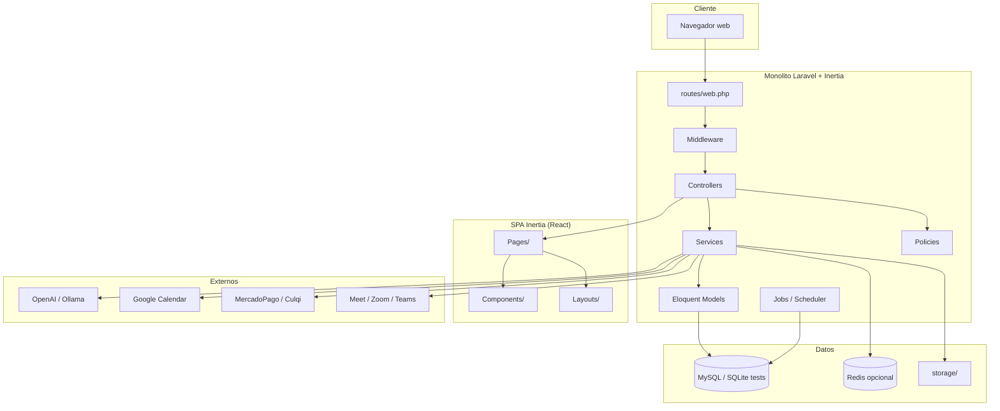
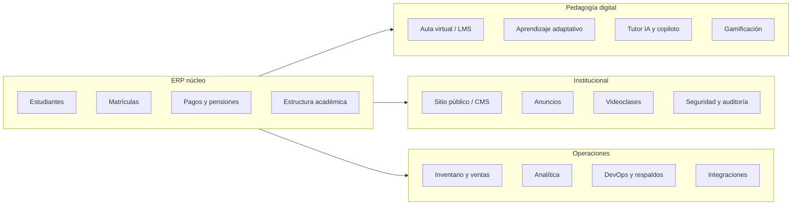

# Documentación de arquitectura — Sistema Colegio Horizonte

**Proyecto:** I.E.P. Horizonte — ERP escolar, LMS, aprendizaje adaptativo e IA pedagógica  
**Versión del documento:** 1.0  
**Stack principal:** Laravel 12 · PHP 8.2 · Inertia.js v2 · React 18 · TypeScript 5 · MySQL 8

---

## 1. Propósito y alcance

Este documento describe la **arquitectura técnica** del sistema: cómo se organizan las capas, los portales, los módulos de negocio, la persistencia, las integraciones y el despliegue. Está orientado a desarrolladores, revisores técnicos y equipos de operaciones.

Para el historial de implementación por fases (Fase 15–32+), ver [`ARCHITECTURE.md`](./ARCHITECTURE.md). Para pruebas y calidad, ver [`DOCUMENTACION_PRUEBAS_TECNICAS.md`](./DOCUMENTACION_PRUEBAS_TECNICAS.md).

---

## 2. Visión general

El sistema es un **monolito modular** desplegable como una sola aplicación. No existe API REST separada para el frontend: la interfaz consume páginas **Inertia** que Laravel renderiza con props serializadas a JSON.

### 2.1 Portales funcionales

| Portal | Audiencia | Prefijo URL | Layout React |
|--------|-----------|-------------|--------------|
| **Sitio público** | Visitantes, familias | `/`, `/nosotros`, `/admision`, … | `PublicLayout` |
| **Intranet ERP** | Administrador, Secretaría | `/intranet/*` | `IntranetLayout` |
| **Portal docente** | Docente (+ Admin) | `/teacher/*` | `TeacherLayout` |
| **Portal estudiante** | Estudiante (+ Admin) | `/student/*` | `StudentLayout` |
| **Autenticación** | Todos | `/login`, `/register`, … | `LoginLayout` / Breeze |

### 2.2 Diagrama de alto nivel



### 2.3 Principios arquitectónicos

1. **Laravel como capa de entrega:** HTTP, sesiones, colas, políticas y validación viven en el ecosistema Laravel.
2. **Controladores delgados:** validan con Form Requests, autorizan con Policies y delegan lógica a Services.
3. **Servicios por dominio:** orquestación reutilizable (`StudentService`, `PaymentService`, `LMSService`, etc.).
4. **Modelos Eloquent enfocados en persistencia:** relaciones, casts y scopes; reglas complejas fuera del modelo cuando crece la complejidad.
5. **Frontend por contexto:** páginas agrupadas por portal (`Pages/Public`, `Pages/Intranet`, `Pages/Teacher`, `Pages/Student`).
6. **Integraciones con fallback:** proveedores `Null*` cuando un servicio externo no está configurado.
7. **Seguridad en capas:** roles Spatie en rutas + políticas por recurso + middleware transversal.

---

## 3. Stack tecnológico

### 3.1 Backend

| Componente | Tecnología | Notas |
|------------|------------|-------|
| Framework | Laravel **12** | Bootstrap en `bootstrap/app.php` |
| Lenguaje | PHP **^8.2** | Enums nativos, readonly, tipado estricto |
| Auth | Laravel Breeze | Sesión web, verificación de email |
| Roles | Spatie Permission **^6.25** | 5 roles institucionales |
| SPA bridge | Inertia Laravel **^2** | Sin API REST intermedia |
| Rutas en JS | Ziggy **^2** | `route('nombre')` en TypeScript |
| PDF | DomPDF | Comprobantes y reportes |
| Tests | PHPUnit **11** | ~340 tests feature/unit |

### 3.2 Frontend

| Componente | Tecnología | Notas |
|------------|------------|-------|
| UI | React **18** + TypeScript **5** | Entry: `resources/js/app.tsx` |
| Build | Vite **7** | `tsc && vite build` |
| Estilos | Tailwind CSS **3** | `@tailwindcss/forms` |
| Componentes | Headless UI, Lucide, Framer Motion, Recharts | Por dominio en `Components/` |
| E2E | Cypress **15** | 24 specs en `cypress/e2e/` |

### 3.3 Infraestructura

| Componente | Desarrollo | Producción |
|------------|------------|------------|
| Base de datos | SQLite (tests/`.env.example`) | **MySQL 8** (Docker, Railway) |
| Cache / colas | `database` por defecto | Redis en `docker-compose.yml` |
| Servidor web | `php artisan serve` / Nginx Docker | Railway + `docker/railway-start.sh` |
| CI | GitHub Actions | Pint, PHPUnit+PCOV, build Vite, SonarQube |

---

## 4. Estructura del repositorio

```
sistema-colegio-horizonte/
├── app/                      # Código de aplicación
│   ├── AI/                   # Contratos y proveedores de IA
│   ├── Console/Commands/     # Comandos artisan institucionales
│   ├── Enums/                # Estados y catálogos (42 enums)
│   ├── Http/
│   │   ├── Controllers/      # ~95 controladores
│   │   ├── Middleware/       # Inertia, seguridad, auditoría
│   │   └── Requests/         # Form Requests de validación
│   ├── Integrations/         # Calendario, pagos, webhooks, push
│   ├── Jobs/                 # 17 jobs en cola
│   ├── Meetings/             # Proveedores de videoconferencia
│   ├── Models/               # 73 modelos Eloquent
│   ├── Policies/             # 50 políticas de autorización
│   ├── Services/             # 62 servicios de dominio
│   └── Support/              # Navegación, dashboards, utilidades
├── bootstrap/app.php         # Middleware, routing, aliases Spatie
├── config/                   # 22 archivos de configuración
├── database/
│   ├── migrations/           # 44 migraciones
│   ├── seeders/              # Datos demo institucionales
│   └── factories/
├── docker/                   # Nginx, Dockerfile.dev, railway-start.sh
├── docs/                     # Documentación del proyecto
├── resources/
│   ├── js/                   # Frontend Inertia/React
│   │   ├── Pages/            # Páginas por portal
│   │   ├── Components/       # UI reutilizable
│   │   ├── Layouts/          # Shells de cada portal
│   │   └── types/            # Tipos TypeScript compartidos
│   └── views/app.blade.php   # Root HTML de Inertia
├── routes/
│   ├── web.php               # Rutas principales (~640 líneas)
│   ├── auth.php              # Breeze (login, registro, reset)
│   ├── webhooks.php          # Webhooks externos
│   └── console.php           # Scheduler y tareas programadas
├── tests/                    # PHPUnit
├── Dockerfile                # Imagen producción multi-stage
├── docker-compose.yml        # Stack local completo
└── railway.json              # Configuración Railway
```

---

## 5. Flujo de una petición HTTP

```
Cliente
  → Nginx / artisan serve
  → Middleware global (web)
      → HandleInertiaRequests      # Props compartidas (auth, nav, flash)
      → SecurityHeadersMiddleware
      → PreventSuspiciousAccess
      → VerifyActiveSession        # Revocación de sesiones
      → LogUserActivity            # Auditoría de actividad
  → Middleware de ruta (auth, verified, role:…)
  → Controller
      → authorize() vía Policy
      → Form Request (validación)
      → Service (lógica de negocio)
      → Model / DB / Jobs
  → Inertia::render('Portal/Pagina', $props)
  → React resuelve Pages/Portal/Pagina.tsx
```

### 5.1 Props compartidas de Inertia

Definidas en `app/Http/Middleware/HandleInertiaRequests.php`:

| Prop | Contenido |
|------|-----------|
| `auth.user` | id, name, email, roles |
| `sidebarNav` | Menú intranet según rol |
| `teacherNav` | Menú portal docente |
| `studentNav` | Menú portal estudiante |
| `announcementBell` | Avisos no leídos |
| `notificationCenter` | Centro de notificaciones |
| `flash` | success, error, respuestas IA |

### 5.2 Resolución de páginas React

En `resources/js/app.tsx`:

```typescript
resolvePageComponent(
  `./Pages/${name}.tsx`,
  import.meta.glob('./Pages/**/*.tsx')
)
```

El string de `Inertia::render()` debe coincidir con la ruta del archivo. Ejemplo: `Inertia::render('Teacher/Dashboard')` → `resources/js/Pages/Teacher/Dashboard.tsx`.

---

## 6. Capas del backend

### 6.1 Controladores

Organizados por portal y dominio:

| Grupo | Ubicación / patrón | Ejemplo |
|-------|-------------------|---------|
| Sitio público | `PublicSiteController` | CMS + páginas institucionales |
| ERP intranet | Raíz `app/Http/Controllers/` | `StudentController`, `PaymentController` |
| Estructura académica | `Academic/` | `GradeController`, `SectionController` |
| CMS | `Intranet/Cms/` | `CmsPageController`, `CmsNewsController` |
| Portal docente | Prefijo `Teacher*` | `TeacherAttendanceController` |
| Portal estudiante | Prefijo `Student*` | `StudentAIController` |
| Sistema | `Intranet*Controller` | Seguridad, integraciones, DevOps |

**Convención:** `{Entidad}Controller` o `{Portal}{Función}Controller`.

### 6.2 Form Requests

64 clases en `app/Http/Requests/`:

- `Store{Entidad}Request` / `Update{Entidad}Request`
- Subcarpetas: `Auth/`, `Intranet/`, `Intranet/Cms/`, `Student/`, `AI/`
- Validación + autorización implícita antes del controlador

### 6.3 Services

62 servicios en `app/Services/`. Agrupación por dominio:

| Dominio | Servicios representativos |
|---------|-------------------------|
| Académico | `StudentService`, `EnrollmentService`, `AttendanceService`, `AcademicGradeService` |
| Finanzas | `PaymentService`, `PensionService`, `PaymentReceiptService`, `CashRegisterService` |
| LMS | `LMSService`, `AssignmentService`, `OnlineExamService`, `VirtualClassroomAccessService` |
| Adaptativo | `AdaptiveDiagnosticService`, `AdaptiveAnalyticsService`, `DiagnosticExamAccessService` |
| IA | `AITutorService`, `AIGenerationService`, `TeacherAICopilotService`, `AcademicMemoryService` |
| CMS | `Cms/CmsContentService`, `CmsPublicService`, `CmsMediaService` |
| Operaciones | `SystemHealthService`, `AuditService`, `InstitutionBackupService`, `AnalyticsService` |
| Comunicaciones | `AnnouncementService`, `UserNotificationService`, `VirtualMeetingService` |

### 6.4 Modelos Eloquent

73 modelos en `app/Models/`:

- Entidades núcleo: `User`, `Student`, `Guardian`, `Enrollment`, `AcademicYear`
- Subdominio CMS: `Models/Cms/CmsPage`, `CmsNews`, `CmsGallery`, …
- Trait de cifrado: `Models/Concerns/EncryptsPersonalAttributes`

### 6.5 Policies

50 políticas en `app/Policies/`:

- **Convención Laravel:** `StudentPolicy` → modelo `Student`
- **Registro manual** en `AppServiceProvider` para dashboards y LMS: `AIDashboard`, `VirtualClassroomPolicy`, `DiagnosticExamPolicy`, etc.

Uso típico en controladores:

```php
$this->authorize('viewAny', Student::class);
$this->authorize('update', $enrollment);
```

### 6.6 Enums

42 enums en `app/Enums/` para estados cerrados:

- `IntranetRole` — roles del sistema
- `EnrollmentStatus`, `PaymentStatus`, `AttendanceStatus`
- `AuditModule`, `CmsPublicationStatus`
- Catálogos LMS, gamificación, reuniones virtuales

### 6.7 Jobs y programación

**Jobs** (`app/Jobs/`, 17 clases, `ShouldQueue`):

| Categoría | Jobs |
|-----------|------|
| Insights IA | `GenerateStudentInsightsJob`, `GenerateTeacherInsightsJob`, `GenerateInstitutionInsightsJob` |
| Alertas | `AcademicAlertScanJob`, `FinancialAlertScanJob`, `SecurityHealthScanJob` |
| Comunicaciones | `SendAcademicRemindersJob`, `SendFinancialRemindersJob`, `SendMeetingRemindersJob`, `NotifyAnnouncementPublishedJob` |
| Operaciones | `CreateInstitutionalBackupJob`, `InstitutionMetricsSnapshotJob`, `ProcessAnalyticsExportJob` |

**Scheduler** (`routes/console.php`): respaldos diarios, purga de auditoría, alertas, recordatorios, métricas horarias. En Docker corre el servicio `scheduler` con `php artisan schedule:work`.

---

## 7. Capas del frontend

### 7.1 Páginas (`resources/js/Pages/`)

| Carpeta | Contenido |
|---------|-----------|
| `Public/` | Home, Nosotros, Niveles, Admisión, Noticias, Galería, Contacto |
| `Auth/` | Login, registro, recuperación de contraseña (Breeze) |
| `Intranet/` | ERP: estudiantes, matrículas, pagos, inventario, CMS, seguridad, sistema |
| `Teacher/` | Dashboard, asistencia, notas, diagnósticos, copiloto IA, aulas, reuniones |
| `Student/` | Dashboard, tutor IA, aulas, diagnóstico, gamificación, pagos |
| `Profile/` | Perfil de usuario |
| `Notifications/` | Centro de notificaciones |

### 7.2 Componentes (`resources/js/Components/`)

Organizados por dominio:

`AI/`, `Analytics/`, `Announcements/`, `App/` (design system), `Auth/`, `Gamification/`, `Integrations/`, `Intranet/`, `Meetings/`, `Notifications/`, `Public/`, `Security/`, `Student/`, `Teacher/`

Componentes Breeze en la raíz: `TextInput`, `Checkbox`, `NavLink`, `PrimaryButton`, etc.

### 7.3 Layouts

| Layout | Uso |
|--------|-----|
| `PublicLayout.tsx` | Sitio institucional |
| `IntranetLayout.tsx` | ERP con sidebar (`IntranetNavigation`) |
| `TeacherLayout.tsx` | Portal docente |
| `StudentLayout.tsx` | Portal estudiante |
| `AuthenticatedLayout.tsx` | Breeze genérico |
| `LoginLayout.tsx` | Pantallas de auth |

### 7.4 Tipos TypeScript

- `resources/js/types/index.d.ts` — `User`, `PageProps`, entidades serializables, navegación
- `resources/js/types/cms.ts` — tipos del CMS
- `resources/js/types/global.d.ts`, `vite-env.d.ts`

### 7.5 Hooks

No hay carpeta `hooks/` centralizada. Los hooks viven co-localizados:

- `Components/Intranet/useEnrollmentStudentPicker.ts`
- `Components/Public/usePublicNavbar.ts`
- `Components/Public/Premium/PublicThemeProvider.tsx`

---

## 8. Autenticación y autorización

### 8.1 Autenticación

- **Mecanismo:** sesión Laravel (cookies HTTP-only)
- **Paquete:** Laravel Breeze (`routes/auth.php`)
- **Verificación:** middleware `verified` en rutas protegidas
- **Sesiones activas:** modelo `UserSession` + middleware `VerifyActiveSession` (revocación remota)

### 8.2 Roles (`app/Enums/IntranetRole.php`)

| Rol | Acceso principal |
|-----|------------------|
| **Administrador** | ERP completo, sistema, seguridad, IA institucional |
| **Secretaría** | Estudiantes, finanzas, matrículas, CMS limitado |
| **Docente** | Portal docente, aulas, asistencia, notas, diagnósticos |
| **Estudiante** | Portal estudiante, LMS, tutor IA, gamificación |
| **Apoderado** | Definido en enum; rutas específicas según evolución del módulo |

### 8.3 Protección de rutas

Patrón en `routes/web.php`:

```php
$intranetRoles = 'role:' . IntranetRole::middlewarePipe();

Route::middleware(['auth', 'verified', $intranetRoles])->group(function () {
    Route::middleware(['role:Docente|Administrador'])->prefix('teacher')...
    Route::middleware(['role:Estudiante|Administrador'])->prefix('student')...
});
```

### 8.4 Middleware de seguridad

| Middleware | Función |
|------------|---------|
| `SecurityHeadersMiddleware` | CSP, HSTS, X-Frame-Options |
| `PreventSuspiciousAccess` | Bloqueo por IP / patrones abusivos |
| `VerifyActiveSession` | Invalida sesiones revocadas en BD |
| `LogUserActivity` | Trazabilidad de acciones |
| `throttle:ai` | Rate limit en endpoints de IA (`config/ai.php`) |

Documentación detallada: [`AUTHORIZATION.md`](./AUTHORIZATION.md), [`SECURITY_POLICY.md`](./SECURITY_POLICY.md).

---

## 9. Módulos de dominio

### 9.1 Mapa funcional



### 9.2 Tabla de módulos

| Módulo | Modelos clave | Servicios | Portal principal |
|--------|---------------|-----------|------------------|
| Estudiantes y apoderados | `Student`, `Guardian` | `StudentService`, `GuardianService` | Intranet |
| Matrículas | `Enrollment` | `EnrollmentService` | Intranet |
| Estructura académica | `Grade`, `Section`, `Subject`, `Classroom` | `SectionService`, `EvaluationService` | Intranet |
| Asistencia y notas | `Attendance`, `GradeRecord` | `AttendanceService`, `AcademicGradeService` | Intranet + Teacher |
| Finanzas | `Payment`, `Pension`, `PaymentConcept` | `PaymentService`, `PensionService` | Intranet + Student |
| Inventario y caja | `Product`, `Sale`, `CashRegister` | `SaleService`, `CashRegisterService` | Intranet |
| Aula virtual (LMS) | `VirtualClassroom`, `Assignment`, `OnlineExam` | `LMSService`, `AssignmentService` | Teacher + Student |
| Aprendizaje adaptativo | `DiagnosticExam`, `QuestionBank`, `StudentAdaptiveProfile` | `AdaptiveDiagnosticService` | Teacher + Student + Intranet |
| Tutor IA | — | `AITutorService`, `AIGenerationService` | Student + Teacher |
| Gamificación | `GamificationProfile`, `Achievement`, `Challenge` | `GamificationService` | Student + Intranet |
| Videoclases | `VirtualMeeting`, `MeetingParticipant` | `VirtualMeetingService` | Teacher + Student |
| CMS | `Cms/CmsPage`, `CmsNews`, `CmsGallery` | `CmsPublicService`, `CmsContentService` | Public + Intranet |
| Seguridad | `AuditLog`, `LoginAttempt`, `UserSession` | `AuditService`, `SecurityService` | Intranet |
| Integraciones | `IntegrationWebhookLog` | `WebhookService`, `IntegrationRegistry` | Intranet + webhooks |

### 9.3 Convención de nombres de rutas

| Prefijo | Ejemplo |
|---------|---------|
| `public.*` | `public.home`, `public.noticias.show` |
| `intranet.*` | `intranet.students.index`, `intranet.payments.store` |
| `teacher.*` | `teacher.dashboard`, `teacher.classrooms.show` |
| `student.*` | `student.dashboard`, `student.ai-tutor` |

Constantes de paths compartidos: `app/Support/WebRoutePaths.php`.

---

## 10. Capa de datos

### 10.1 Base de datos

- **Desarrollo / tests:** SQLite en memoria o archivo (`phpunit.xml`, `.env.example`)
- **Producción:** MySQL 8 con SSL opcional (`config/database.php`, `DB_SSL=true` en Railway)
- **Migraciones:** 44 archivos en `database/migrations/`, agrupados por dominio y fecha

### 10.2 Relaciones representativas

```
User 1──1 Student
Student N──M Guardian
Student 1──N Enrollment
Enrollment N──1 AcademicYear, Section, Grade
Section 1──N VirtualClassroom
VirtualClassroom 1──N Assignment, OnlineExam
Student 1──1 GamificationProfile, StudentAdaptiveProfile
```

### 10.3 Cifrado de datos personales

Campos sensibles cifrados con cast `encrypted` de Laravel (AES-256-CBC vía `APP_KEY`):

| Modelo | Campos cifrados |
|--------|-----------------|
| `Student` | `document_number`, `phone`, `email`, `address`, … |
| `Guardian` | Datos de contacto e identificación |
| `VirtualMeeting` | `join_password` |

**Búsqueda por documento:** hash HMAC-SHA256 en `document_number_hash` (`app/Support/SensitiveDataHasher.php`).

**Comando de migración:** `php artisan data:encrypt-personal`  
**Configuración:** `config/security.php` → `encrypt_personal_data`

### 10.4 Seeders

`DatabaseSeeder` orquesta datos demo: roles, año académico, estructura, estudiantes, CMS, conceptos de pago, inventario demo.

---

## 11. Inteligencia artificial

### 11.1 Arquitectura de proveedores

```
AITutorService / AIGenerationService
        │
        ▼
AIProviderInterface (app/AI/Contracts/)
        │
        ├── OpenAIProvider      ← producción (config/ai.php + OPENAI_API_KEY)
        ├── OllamaProvider      ← expansión local
        ├── GeminiProvider      ← stub
        ├── ClaudeProvider      ← stub
        └── NullAIProvider      ← cuando AI_TUTOR_ENABLED=false
```

**Fallback local:** `LocalTutorFallbackService` cuando el proveedor externo no está disponible.

### 11.2 Módulos de IA

| Módulo | Usuario | Servicio |
|--------|---------|----------|
| Tutor estudiante | Estudiante | `AITutorService` |
| Coach de aprendizaje | Estudiante | `StudentLearningCoachService` |
| Copiloto docente | Docente | `TeacherAICopilotService` |
| Generación de exámenes/tareas | Docente | `AIGenerationService` |
| Analítica IA institucional | Administrador | `AdvancedAIAnalyticsService` |
| Memoria académica | Sistema | `AcademicMemoryService` |

**Rate limiting:** `throttle:ai` registrado en `AppServiceProvider` según `config/ai.php`.

Documentación extendida: [`AI_ARCHITECTURE.md`](./AI_ARCHITECTURE.md).

---

## 12. Integraciones externas

Capa en `app/Integrations/` con patrón **Contract → Provider → Null fallback**:

| Integración | Proveedores | Config |
|-------------|-------------|--------|
| Calendario | `GoogleCalendarProvider`, `NullCalendarProvider` | `config/calendar.php` |
| Pagos | `MercadoPagoProvider`, `CulqiProvider`, `NullPaymentGateway` | `config/payments_gateway.php` |
| Mensajería | `WhatsAppProvider`, `NullMessagingProvider` | `config/messaging.php` |
| Push | `FirebasePushProvider`, `NullPushProvider` | `config/push.php` |
| Webhooks | `WebhookService` | `routes/webhooks.php` |
| Correo institucional | `InstitutionMailService` | `config/mail.php` |

**Videoconferencias** (`app/Meetings/`): Google Meet, Zoom, Teams, `NullMeetingProvider` — `config/meetings.php`.

**Webhooks públicos** (`routes/webhooks.php`):

- `POST /webhooks/payments`
- `POST /webhooks/mercadopago`
- `POST /webhooks/calendar`

Documentación: [`INTEGRATIONS.md`](./INTEGRATIONS.md).

---

## 13. Seguridad transversal

| Capa | Implementación |
|------|----------------|
| Transporte | HTTPS en producción (`SESSION_SECURE_COOKIE`, proxy trust) |
| Autenticación | Breeze + verificación email + bloqueo por intentos (`config/security.php`) |
| Autorización | Spatie roles + 50 Policies |
| Auditoría | `AuditService`, `AuditLog`, módulos por `AuditModule` enum |
| Sesiones | `UserSession`, revocación, purge programado |
| Datos personales | Cifrado AES-256, hash para búsqueda |
| Headers HTTP | CSP, HSTS, anti-clickjacking |
| IA | Throttle, hash de prompts en auditoría, sin claves en código |

---

## 14. Despliegue e infraestructura

### 14.1 Docker local (`docker-compose.yml`)

| Servicio | Función | Puerto |
|----------|---------|--------|
| `app` | PHP-FPM | — |
| `nginx` | Proxy HTTP | **8080** |
| `mysql` | MySQL 8.4 | 33060 |
| `redis` | Cache/colas | 63790 |
| `queue` | `queue:work` | — |
| `scheduler` | `schedule:work` | — |

### 14.2 Imagen de producción (`Dockerfile`)

Multi-stage:

1. **Stage assets:** Node 20 → `npm ci && npm run build`
2. **Stage final:** PHP 8.2-cli con extensiones `pdo_mysql`, `gd`, `intl`, etc.
3. **CMD:** `docker/railway-start.sh`

Secuencia de arranque:

```bash
php artisan migrate --force
php artisan data:encrypt-personal
php artisan storage:link
php artisan config:cache && route:cache && view:cache
php artisan serve --host=0.0.0.0 --port=$PORT
```

### 14.3 Railway

| Archivo | Rol |
|---------|-----|
| `railway.json` | Build Railpack + `npm run build` |
| `railway/init-app.sh` | Pre-deploy: migrate, cache |
| `docker/railway-start.sh` | Bootstrap completo en runtime |

**Producción:** https://web-production-c87da.up.railway.app

### 14.4 CI/CD

`.github/workflows/ci.yml`:

- Job `tests`: Pint, PHPUnit + PCOV → `clover.xml`, build Vite
- Job `sonarqube`: análisis estático (requiere `SONAR_TOKEN`)

---

## 15. Configuración relevante

| Archivo | Propósito |
|---------|-----------|
| `config/ai.php` | Proveedor IA, módulos, prompts, rate limits |
| `config/integrations.php` | Feature flags de integraciones |
| `config/security.php` | Login lockout, cifrado, sesiones |
| `config/institution.php` | Nombre colegio, RUC, mensajes de comprobante |
| `config/lms.php` | Límites de subida en tareas |
| `config/devops.php` | Retención auditoría, respaldos, métricas |
| `config/permission.php` | Spatie roles y permisos |
| `config/database.php` | Conexiones SQLite/MySQL, SSL |

Variables sensibles siempre en `.env` (nunca en el repositorio). Plantilla: `.env.example`.

---

## 16. Convenciones de nomenclatura

| Capa | Patrón | Ejemplo |
|------|--------|---------|
| Controller | `{Entidad}Controller` | `EnrollmentController.php` |
| Service | `{Dominio}Service` | `PaymentReceiptService.php` |
| Policy | `{Modelo}Policy` | `DiagnosticExamPolicy.php` |
| Form Request | `Store/Update{Entidad}Request` | `StoreEnrollmentRequest.php` |
| Job | `{Verbo}{Sustantivo}Job` | `SendFinancialRemindersJob.php` |
| Enum | PascalCase backed string | `EnrollmentStatus.php` |
| Model | Singular PascalCase | `GradeRecord.php` |
| Página Inertia | `{Portal}/{Módulo}/{Acción}.tsx` | `Intranet/Payments/Create.tsx` |
| Ruta nombrada | `{portal}.{módulo}.{acción}` | `intranet.enrollments.store` |

---

## 17. Documentación relacionada

| Documento | Contenido |
|-----------|-----------|
| [`ARCHITECTURE.md`](./ARCHITECTURE.md) | Evolución por fases de desarrollo |
| [`AI_ARCHITECTURE.md`](./AI_ARCHITECTURE.md) | Detalle del módulo de IA |
| [`AUTHORIZATION.md`](./AUTHORIZATION.md) | Matriz de permisos y políticas |
| [`SECURITY_POLICY.md`](./SECURITY_POLICY.md) | Política de seguridad institucional |
| [`INTEGRATIONS.md`](./INTEGRATIONS.md) | Integraciones externas |
| [`DOCUMENTACION_PRUEBAS_TECNICAS.md`](./DOCUMENTACION_PRUEBAS_TECNICAS.md) | TDD, BDD, Cypress, SonarQube, CI |
| [`TESTING_STRATEGY.md`](./TESTING_STRATEGY.md) | Estrategia de pruebas |
| [`KNOWN_LIMITATIONS.md`](./KNOWN_LIMITATIONS.md) | Limitaciones conocidas |

---

## 18. Glosario

| Término | Definición |
|---------|------------|
| **ERP** | Planificación de recursos empresariales; aquí, gestión administrativa escolar |
| **LMS** | Learning Management System; aula virtual con tareas y exámenes |
| **Inertia** | Puente que permite SPA React sin API REST separada |
| **Policy** | Clase Laravel que define quién puede hacer qué sobre un recurso |
| **Service** | Clase que orquesta lógica de negocio reutilizable |
| **Null provider** | Implementación vacía cuando una integración no está configurada |
| **Adaptive learning** | Diagnósticos y rutas personalizadas según desempeño |
| **Monolito modular** | Una aplicación desplegable con separación lógica por dominio |

---

*Última actualización: junio 2026 — Sistema Colegio Horizonte v1.0*
