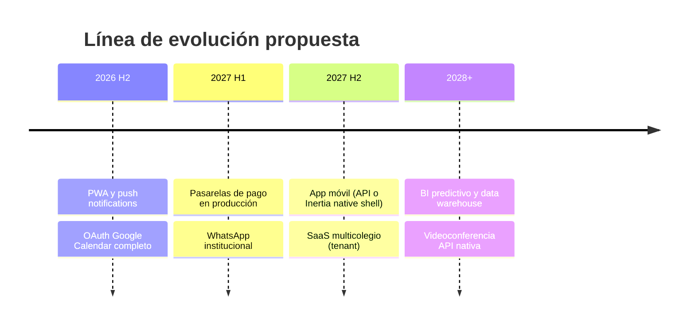
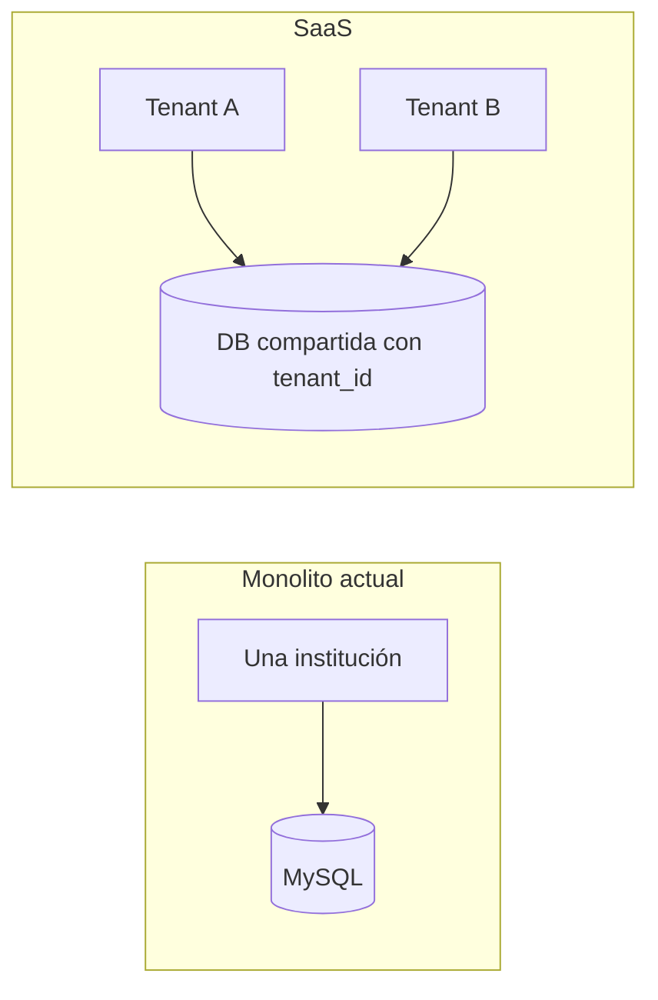

# Roadmap visual — Evolución futura

Plan **prospectivo** del Sistema Colegio Horizonte. No describe funcionalidad ya desplegada; complementa `ROADMAP.md` (raíz) sin modificarlo.

---

## Horizonte temporal

---

## Iniciativas futuras

| Iniciativa | Descripción | Dependencias | Prioridad sugerida |
|------------|-------------|--------------|-------------------|
| **PWA** | Instalable, offline básico para consultas | Service worker, manifest | Media |
| **SaaS multicolegio** | `tenant_id`, aislamiento BD o schema | Refactor auth y facturación | Alta (comercial) |
| **BI predictivo** | Modelos sobre histórico notas/asistencia | Data limpia, ETL | Media |
| **App móvil** | React Native o API REST dedicada | Capa API o Inertia mobile | Media |
| **Integraciones reales** | MP, Culqi, WhatsApp en prod | Credenciales, PCI | Alta |
| **Push notifications** | Firebase FCM | `FirebasePushProvider` activo | Media |
| **Videoconferencia API** | Crear sala Zoom/Meet vía API | Cuentas institucionales | Media |
| **BI avanzado** | Dashboards ejecutivos cross-módulo | Warehouse | Baja–Media |
| **Data warehouse** | Réplica analítica (BigQuery, PG, etc.) | Pipeline nocturno | Baja |

---

## Matriz esfuerzo vs impacto

|  | Bajo esfuerzo | Alto esfuerzo |
|--|---------------|---------------|
| **Alto impacto** | Push + SMTP prod | SaaS multicolegio |
| **Medio impacto** | OAuth Calendar | App móvil |
| **Bajo impacto** | PWA lectura | Data warehouse |

---

## PWA (detalle)

- Cache de assets estáticos y páginas públicas CMS.
- Notificaciones push cuando FCM esté activo.
- **Estado actual:** sitio responsive; PWA no implementada.

---

## SaaS multicolegio

---

## Integraciones reales (pagos y mensajería)

| Canal | Estado actual | Siguiente paso |
|-------|---------------|----------------|
| Mercado Pago | Provider + Null fallback | Webhooks + checkout UI |
| Culqi | Provider stub | Certificación Perú |
| WhatsApp | `WhatsAppProvider` preparado | Meta Business API + plantillas |
| Google Calendar | Export parcial | OAuth2 refresh tokens |

---

## BI y analítica avanzada

1. **Fase intermedia:** export CSV/PDF desde dashboards actuales.
2. **Fase avanzada:** warehouse + vistas materializadas + predicción deserción.
3. **Métricas IA:** costo por token, uso por docente (ya base en `ai-analytics`).

---

## Criterios de entrada a producción por iniciativa

| Iniciativa | Criterio mínimo |
|------------|-----------------|
| Pagos en línea | PCI scope, pruebas sandbox, rollback |
| WhatsApp | Opt-in apoderados, plantillas aprobadas |
| SaaS | Tests de aislamiento tenant, backup por cliente |
| PWA | Lighthouse PWA ≥ 80 |

---

## Relación con documentación existente

- Implementado hoy → `REQUIREMENTS_TRACEABILITY_MATRIX.md`, fases en `phases/`.
- Operación → `deployment/`, `security/`.
- Este archivo → visión **estratégica** para jurado e inversión institucional.
