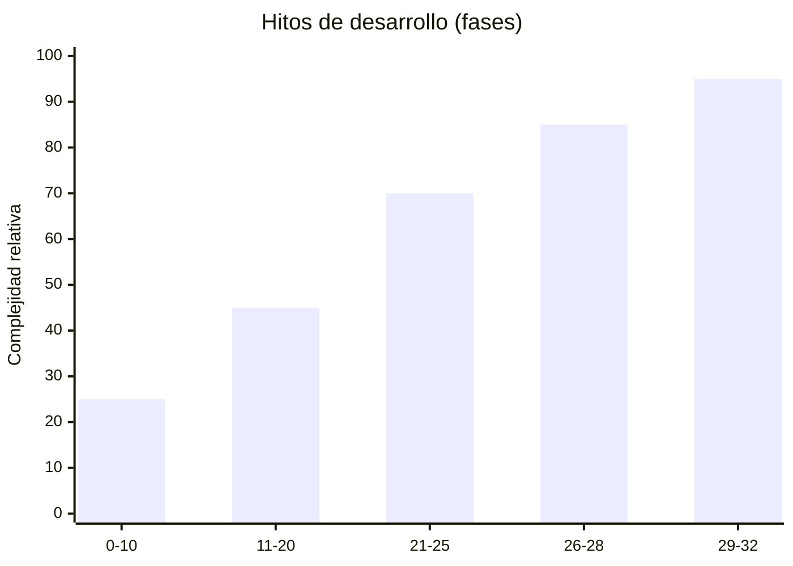

# Métricas del proyecto

Métricas **aproximadas** obtenidas del repositorio (mayo 2026). Sirven para informes académicos y presentación de alcance; no sustituyen herramientas de cobertura de código.

---

## Resumen ejecutivo

| Dimensión | Valor aproximado |
|-----------|----------------|
| Fases documentadas | 0–32 (33 hitos) |
| Módulos funcionales principales | 12 |
| Modelos Eloquent | ~70 |
| Servicios de aplicación | ~60 |
| Controladores HTTP | ~95 |
| Páginas Inertia (TSX) | ~220 |
| Migraciones de BD | 43 |
| Roles intranet | 5 |
| Tests PHPUnit | 336 (1719 assertions) |
| Features BDD (Gherkin) | 24 |
| Specs Cypress E2E | 24 |
| Proveedores integración | 6 familias (mail, calendar, payments, messaging, push, webhooks) |
| Proveedores IA | 4 (OpenAI, Ollama, Gemini, Null) |

---

## Módulos y dominios

| # | Módulo | Servicios clave (ejemplo) | Estado |
|---|--------|---------------------------|--------|
| 1 | ERP / Académico | `StudentService`, `EnrollmentService` | Producción |
| 2 | Finanzas | `PaymentService`, `PensionService` | Producción |
| 3 | Inventario / Ventas | `ProductService`, `SaleService` | Producción |
| 4 | LMS | `LMSService`, `OnlineExamService` | Producción |
| 5 | Adaptive | `AdaptiveDiagnosticService` | Producción |
| 6 | IA | `AITutorService`, `TeacherAICopilotService` | Producción |
| 7 | CMS | `CmsContentService`, `CmsPublicService` | Producción |
| 8 | Comunicación | `AnnouncementService` | Producción |
| 9 | Notificaciones | `UserNotificationService` | Producción |
| 10 | Gamificación | `GamificationService` | Producción |
| 11 | Meetings | `VirtualMeetingService` | Producción |
| 12 | Integraciones | `IntegrationRegistry`, webhooks | Parcial / preparado |

---

## Frontend

| Métrica | Valor |
|---------|-------|
| Componentes design system `App*` | 13+ (`AppCard`, `AppTable`, `AppFilterBar`, …) |
| Layouts intranet | `IntranetLayout`, `TeacherLayout`, `StudentLayout` |
| Gráficos analítica | Recharts (`AnalyticsLineChart`) |
| Animaciones | Framer Motion (páginas premium) |
| Build producción | Vite 7 + TypeScript strict check |

---

## Backend y datos

| Métrica | Valor |
|---------|-------|
| Enums de dominio | `IntranetRole`, `AuditAction`, `NotificationCategory`, etc. |
| Jobs programados | Notificaciones, recordatorios académicos/financieros, security scan |
| Tablas CMS | ~12 entidades en namespace `App\Models\Cms` |
| Tablas gamificación | Perfiles, logros, retos, transacciones XP |
| Tablas meetings | Reuniones, participantes, asistencia, grabaciones |

---

## Pruebas (última ejecución documentada)

```bash
php artisan test
# Tests: 336 passed (1719 assertions)

npm run build
# tsc && vite build — OK

npm run e2e
# Cypress — 24 especificaciones (requiere app levantada)
```

---

## Dashboards y pantallas clave

| Rol / Área | Ruta representativa |
|------------|---------------------|
| Admin intranet | `/intranet/dashboard` |
| Analítica | `/intranet/analytics` |
| IA analytics | `/intranet/ai-analytics` |
| Integraciones | `/intranet/integrations` |
| Docente | `/teacher/dashboard` |
| Copiloto IA | `/teacher/ai-copilot` |
| Estudiante | `/student/dashboard` |
| Tutor IA | `/student/ai-tutor` |
| Sitio público | `/` |

---

## Integraciones configurables (.env — sin valores)

| Variable (ejemplo) | Propósito |
|--------------------|-----------|
| `MAIL_*` | SMTP |
| `OPENAI_API_KEY` | Tutor / copiloto |
| `AI_PROVIDER` | openai \| ollama \| gemini |
| `GOOGLE_CALENDAR_*` | Calendario (parcial) |
| `MERCADOPAGO_*` / `CULQI_*` | Pagos (preparado) |

---

## Evolución del tamaño del proyecto



*Eje Y cualitativo: complejidad funcional acumulada, no líneas de código.*

---

## Notas metodológicas

- Los conteos de archivos pueden variar ±5% según merges y refactors.
- Duplicados en listados glob (Windows paths) no inflan métricas de negocio.
- Para métricas de **cobertura de código**, ejecutar PHPUnit con `--coverage` en entorno con Xdebug (no incluido por defecto).
