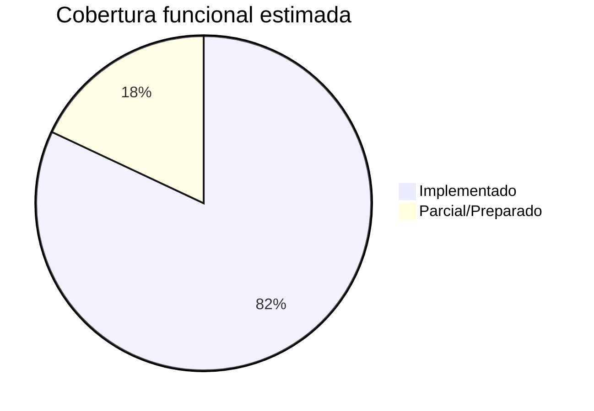

# KPIs y cobertura del sistema

Indicadores de madurez para informes académicos. Los porcentajes son **estimaciones razonadas** basadas en la matriz de requerimientos y el estado del repositorio; no son métricas financieras del colegio.

---

## 1. Cobertura funcional por dominio

| Dominio | Requerimientos trazados | Implementados | % estimado |
|---------|-------------------------|---------------|------------|
| ERP / Finanzas | 10 | 10 | **100%** |
| LMS | 6 | 6 | **100%** |
| CMS | 5 | 5 | **100%** |
| IA | 6 | 5–6 | **90%** |
| Gamificación | 4 | 4 | **100%** |
| Videoclases | 4 | 2–3 | **65%** |
| Notificaciones | 4 | 3 | **85%** |
| Analytics | 4 | 3 | **80%** |
| Seguridad | 5 | 4 | **90%** |
| Integraciones | 6 | 2–4 | **50%** |
| **Global ponderado** | 54 | 44+ | **~82%** |

---

## 2. Cobertura de pruebas

| Capa | Cantidad | Rol en calidad | % confianza estimado |
|------|----------|----------------|----------------------|
| PHPUnit Feature/Unit | 336 tests | Regresión backend y autorización | **Alto** |
| Behat BDD | 24 features | Lenguaje de negocio | **Medio-alto** |
| Cypress E2E | 24 specs | Flujos UI críticos | **Medio** |
| Cobertura líneas PHP | No medido en CI por defecto | — | *N/D* |

**KPI sugerido para producción:** 0 tests fallidos en `main`; E2E verde antes de release mayor.

---

## 3. Madurez del sistema (modelo CMM simplificado)

| Nivel | Descripción | ¿Aplica? |
|-------|-------------|----------|
| 1 Inicial | Ad hoc | No |
| 2 Repetible | Builds y migraciones | Parcial |
| 3 Definido | Tests, docs, roles | **Sí** |
| 4 Gestionado | Métricas prod, SLA | Parcial |
| 5 Optimizado | Auto-scale, BI | Futuro |

**Madurez global estimada:** nivel **3** (definido) en desarrollo; nivel **2–3** en producción según operación del colegio.

---

## 4. Readiness de producción

| Criterio | Estado | Peso |
|----------|--------|------|
| Tests automatizados | ✅ 336 passed | 20% |
| Checklist seguridad documentado | ✅ | 15% |
| Backups / health | ✅ Servicios + UI | 15% |
| Colas y scheduler documentados | ✅ | 10% |
| Integraciones críticas (pago/WA) | ⚠ Preparado | 15% |
| HTTPS y hardening servidor | ⚠ Operación | 15% |
| Monitoreo APM | ❌ No incluido | 10% |

**Readiness ponderado:** **~75%** — apto para piloto institucional; completar integraciones y ops antes de escala masiva.

---

## 5. Integración IA

| KPI | Valor estimado |
|-----|----------------|
| Módulos con IA | Tutor, copiloto, riesgo, analytics, coach |
| Proveedores soportados | 3 + Null |
| Rutas con throttle | Sí (`throttle:ai`) |
| Trazabilidad auditoría | Sí (`audit_logs.metadata`) |
| Dependencia crítica | No — ERP funciona sin IA |

**Índice integración IA:** **85%** (funcional con configuración; costo y quota son riesgo operativo).

---

## 6. Integración LMS

| KPI | Valor |
|-----|-------|
| Portales con LMS | Docente + Estudiante + Admin overview |
| Exámenes online | Sí |
| Vínculo adaptive → LMS | Servicio puente |
| Videoclases | Manual URL |

**Índice LMS:** **90%** del alcance planificado en fases 23 y 30.

---

## 7. KPIs operativos sugeridos (post-despliegue)

| KPI institucional | Fórmula / fuente |
|-------------------|------------------|
| Usuarios activos mensuales | `user_sessions` / logs |
| % asistencia registrada digital | `attendances` vs planilla |
| Entregas LMS a tiempo | `assignment_submissions` |
| Uso tutor IA / estudiante | Auditoría módulo IA |
| Tiempo medio resolución incidencia | Mesa de ayuda (externo) |
| Disponibilidad sistema | Uptime monitor |

*Estos KPIs requieren operación en producción; el software provee los datos base.*

---

## 8. Tablero resumen para slides

---

## 9. Referencias cruzadas

- Detalle requerimientos: [REQUIREMENTS_TRACEABILITY_MATRIX.md](./REQUIREMENTS_TRACEABILITY_MATRIX.md)  
- Riesgos: [RISKS_AND_LIMITATIONS.md](./RISKS_AND_LIMITATIONS.md)  
- Métricas volumen: [PROJECT_METRICS.md](./PROJECT_METRICS.md)
