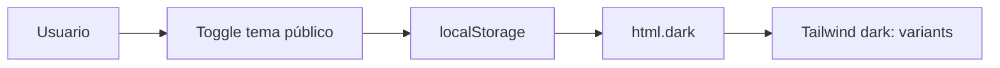

# Sistema de diseño UX/UI

Documentación del lenguaje visual y de interacción del **Sistema Colegio Horizonte**, basada en la implementación actual (Tailwind CSS, componentes React, layouts Inertia).

---

## 1. Principios de diseño

| Principio | Aplicación |
|-----------|------------|
| **Institucional** | Colores y tipografía alineados a identidad I.E.P. Horizonte |
| **Claridad** | Jerarquía tipográfica en dashboards y tablas |
| **Consistencia** | Prefijo `App*` para componentes reutilizables |
| **Responsive** | Mobile-first en sitio público; intranet optimizada desktop/tablet |
| **Premium** | Motion sutil (Framer Motion) en secciones públicas clave |

---

## 2. Design system — componentes `App*`

Ubicación: `resources/js/Components/App/`

| Componente | Propósito |
|------------|-----------|
| `AppCard` | Contenedor con borde/sombra estándar |
| `AppPageHeader` | Título + acciones de página |
| `AppTable` | Tablas de listados intranet |
| `AppFilterBar` | Filtros homogéneos |
| `AppStatCard` | KPI numérico en dashboards |
| `AppBadge` | Estados (activo, pendiente, riesgo) |
| `AppEmptyState` | Listas sin datos |
| `AppModal` / `AppDrawer` | Superposiciones |
| `AppTabs` | Navegación secundaria |
| `AppToolbar` | Acciones agrupadas |
| `AppSection` | Agrupación visual de formularios |
| `AppSkeleton` | Carga perceived performance |

**Convención:** nuevas pantallas intranet deben reutilizar estos bloques antes de crear estilos ad hoc.

---

## 3. Modo claro y oscuro

| Ámbito | Implementación |
|--------|----------------|
| **Sitio público** | `PublicThemeProvider` — `localStorage` key `horizonte-public-theme`, clase `dark` en `<html>` |
| **Intranet** | Predominantemente modo claro; contraste alto para tablas |

---

## 4. Navegación

| Portal | Layout | Patrón |
|--------|--------|--------|
| Público | `PublicLayout` | Navbar + footer institucional |
| Intranet admin/secretaría | `IntranetLayout` + `Sidebar` | Menú lateral jerárquico |
| Docente | `TeacherLayout` | Menú reducido pedagógico |
| Estudiante | `StudentLayout` | Menú centrado en aprendizaje |

**Breadcrumbs:** `IntranetBreadcrumbs` en flujos profundos (CMS, académico).

---

## 5. Responsive

| Breakpoint (Tailwind) | Uso |
|-----------------------|-----|
| `sm` | Ajustes menú móvil público |
| `md` | Tablas con scroll horizontal |
| `lg` | Sidebar intranet fija |
| `xl` | Dashboards multi-columna |

**Páginas críticas móvil:** Home, login, dashboard estudiante (validar en capturas `*-mobile.png`).

---

## 6. UX premium (Fase 25)

- Hero con imágenes CMS (`PublicHeroImage`, `PageHero`).  
- Secciones con `InstitutionalCTA`, `NewsMagazineSection`.  
- Gráficos analítica: `AnalyticsLineChart` (Recharts).  
- Cards de IA: `AIStreamingCard` para feedback de generación.

---

## 7. Accesibilidad básica

| Práctica | Estado |
|----------|--------|
| Contraste texto/fondo en tema claro | Objetivo WCAG AA en componentes principales |
| Labels en formularios (`InputLabel`) | Implementado (Breeze) |
| Focus visible en botones | Tailwind `focus:ring` |
| Texto alternativo en imágenes CMS | Responsabilidad del editor de contenido |
| Navegación solo teclado | Parcial — mejorar en modales |

*No se reclama certificación WCAG completa; es mejora continua.*

---

## 8. Jerarquía visual

1. **Primario:** acciones principales (`PrimaryButton`, `InstitutionalButton`).  
2. **Secundario:** `SecondaryButton`, enlaces de texto.  
3. **Estado:** `AppBadge`, badges de reunión, prioridad de comunicados.  
4. **Datos densos:** `AppTable` con paginación (`SecurityPagination` en módulos seguridad).

---

## 9. Consistencia visual

| Elemento | Estándar |
|----------|----------|
| Espaciado | Escala Tailwind (`p-4`, `gap-6` en cards) |
| Iconografía | `lucide-react` unificado |
| Errores | `InputError` bajo campos |
| Vacío | `AppEmptyState` con mensaje orientador |
| Flash seguridad | `SecurityFlash` en módulos sensibles |

---

## 10. CMS y contenido público

- Editor rich text: `CmsRichTextEditor`.  
- Medios: `CmsMediaLibrary`, `CmsImagePicker`.  
- El contenido dinámico no rompe el design system: se inyecta dentro de layouts públicos existentes.

---

## 11. Relación con mockups

Descripciones pantalla por pantalla: carpeta [mockups/](./mockups/).  
Capturas reales: [screenshots/SCREENSHOT_CAPTURE_CHECKLIST.md](./screenshots/SCREENSHOT_CAPTURE_CHECKLIST.md).

---

## 12. Mejoras futuras UX

- Design tokens en archivo central (colores institucionales exportados).  
- Modo oscuro intranet unificado.  
- Storybook para catálogo `App*`.  
- Reducción de motion para `prefers-reduced-motion`.
