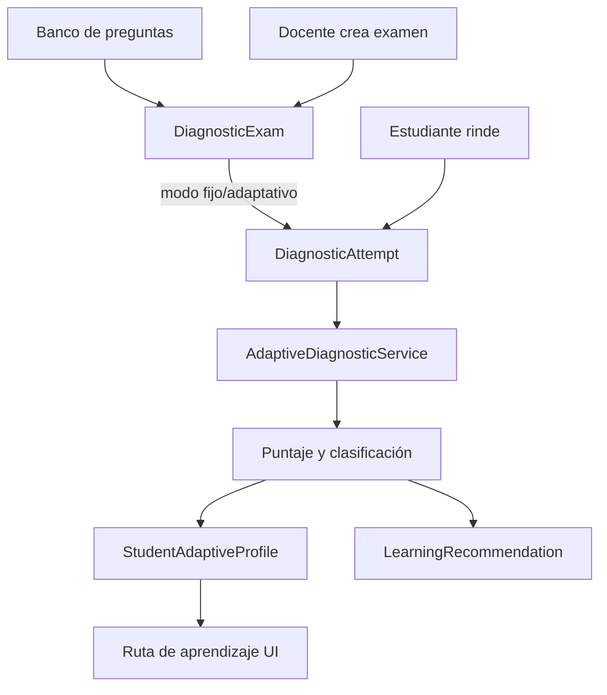

# Diagrama — Aprendizaje adaptativo

```mermaid
flowchart TD
    QB[Banco de preguntas] --> DE[DiagnosticExam]
    DE -->|modo fijo/adaptativo| ATT[DiagnosticAttempt]
    ATT --> ADS[AdaptiveDiagnosticService]
    ADS --> SCR[Puntaje y clasificación]
    SCR --> PROF[StudentAdaptiveProfile]
    SCR --> REC[LearningRecommendation]
    PROF --> LP[Ruta de aprendizaje UI]
    DOC[Docente crea examen] --> DE
    STU[Estudiante rinde] --> ATT
```

## Nota

El motor adaptativo funciona **sin IA externa obligatoria**; la IA puede enriquecer el banco vía copiloto (Fase 31).
