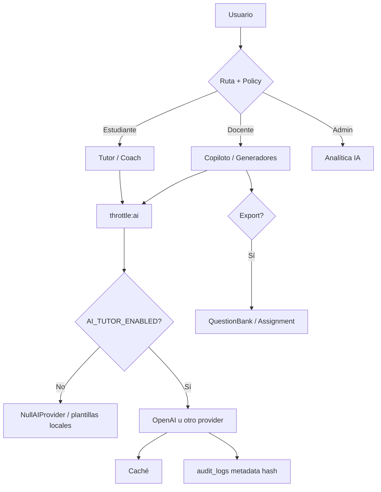

# Diagrama — Flujo IA institucional

```mermaid
flowchart TD
    U[Usuario] --> R{Ruta + Policy}
    R -->|Estudiante| T[Tutor / Coach]
    R -->|Docente| C[Copiloto / Generadores]
    R -->|Admin| A[Analítica IA]

    T --> TH[throttle:ai]
    C --> TH
  TH --> EN{AI_TUTOR_ENABLED?}
    EN -->|No| NULL[NullAIProvider / plantillas locales]
    EN -->|Sí| PR[OpenAI u otro provider]
    PR --> CACHE[Caché]
    PR --> AUD[audit_logs metadata hash]
    C --> EXP{Export?}
    EXP -->|Sí| LMS[QuestionBank / Assignment]
```
