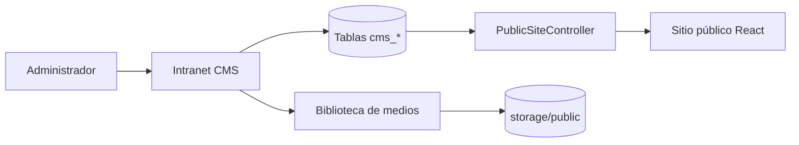

# Diagrama — Flujo CMS

```mermaid
flowchart LR
    ADM[Administrador] --> CMSUI[Intranet CMS]
    CMSUI --> DB[(Tablas cms_*)]
    DB --> PUBCTRL[PublicSiteController]
    PUBCTRL --> WEB[Sitio público React]
    CMSUI --> MEDIA[Biblioteca de medios]
    MEDIA --> STORAGE[(storage/public)]
```
