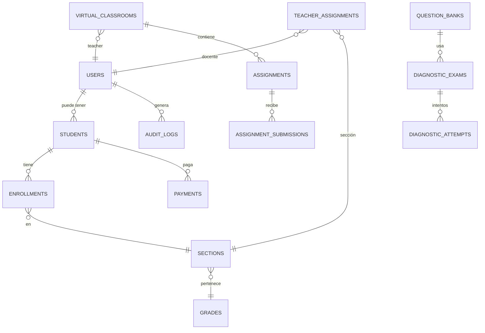

# Diagrama — Relaciones conceptuales (ER simplificado)

```mermaid
erDiagram
    USERS ||--o{ STUDENTS : "puede tener"
    STUDENTS ||--o{ ENROLLMENTS : tiene
    ENROLLMENTS }o--|| SECTIONS : en
    SECTIONS }o--|| GRADES : pertenece
    TEACHER_ASSIGNMENTS }o--|| USERS : docente
    TEACHER_ASSIGNMENTS }o--|| SECTIONS : sección

    VIRTUAL_CLASSROOMS }o--|| USERS : teacher
    VIRTUAL_CLASSROOMS ||--o{ ASSIGNMENTS : contiene
    ASSIGNMENTS ||--o{ ASSIGNMENT_SUBMISSIONS : recibe

    QUESTION_BANKS ||--o{ DIAGNOSTIC_EXAMS : usa
    DIAGNOSTIC_EXAMS ||--o{ DIAGNOSTIC_ATTEMPTS : intentos

    USERS ||--o{ AUDIT_LOGS : genera
    STUDENTS ||--o{ PAYMENTS : paga
```

## Nota

Diagrama **conceptual** para presentación; el detalle de columnas está en `database/CORE_TABLES_DOCUMENTATION.md`.
