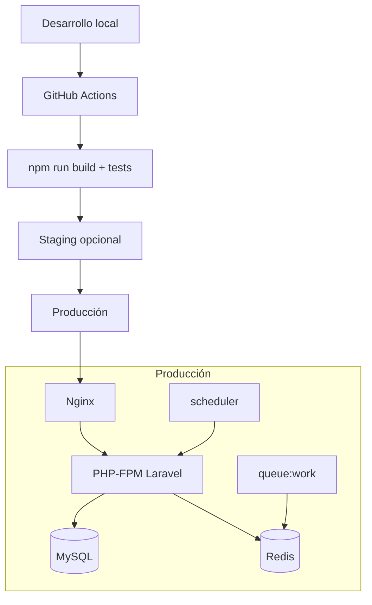

# Diagrama — Despliegue

```mermaid
flowchart TB
    DEV[Desarrollo local] --> CI[GitHub Actions]
    CI --> BUILD[npm run build + tests]
    BUILD --> STG[Staging opcional]
    STG --> PROD[Producción]

    subgraph Producción
        NG[Nginx]
        PHP[PHP-FPM Laravel]
        MY[(MySQL)]
        RD[(Redis)]
        WK[queue:work]
        SCH[scheduler]
    end

    PROD --> NG
    NG --> PHP
    PHP --> MY
    PHP --> RD
    WK --> RD
    SCH --> PHP
```
