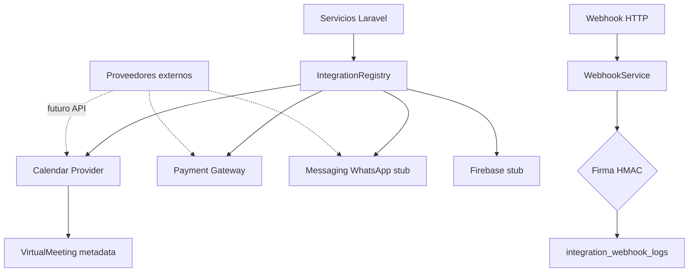

# Diagrama — Integraciones externas

```mermaid
flowchart TB
    APP[Servicios Laravel] --> REG[IntegrationRegistry]
    REG --> CAL[Calendar Provider]
    REG --> PAY[Payment Gateway]
    REG --> MSG[Messaging WhatsApp stub]
    REG --> PUSH[Firebase stub]

    EXT[Proveedores externos] -.->|futuro API| CAL
    EXT -.-> PAY
    EXT -.-> MSG

    WH[Webhook HTTP] --> WS[WebhookService]
    WS --> SIG{Firma HMAC}
    SIG --> LOG[integration_webhook_logs]

    CAL --> MEET[VirtualMeeting metadata]
```
