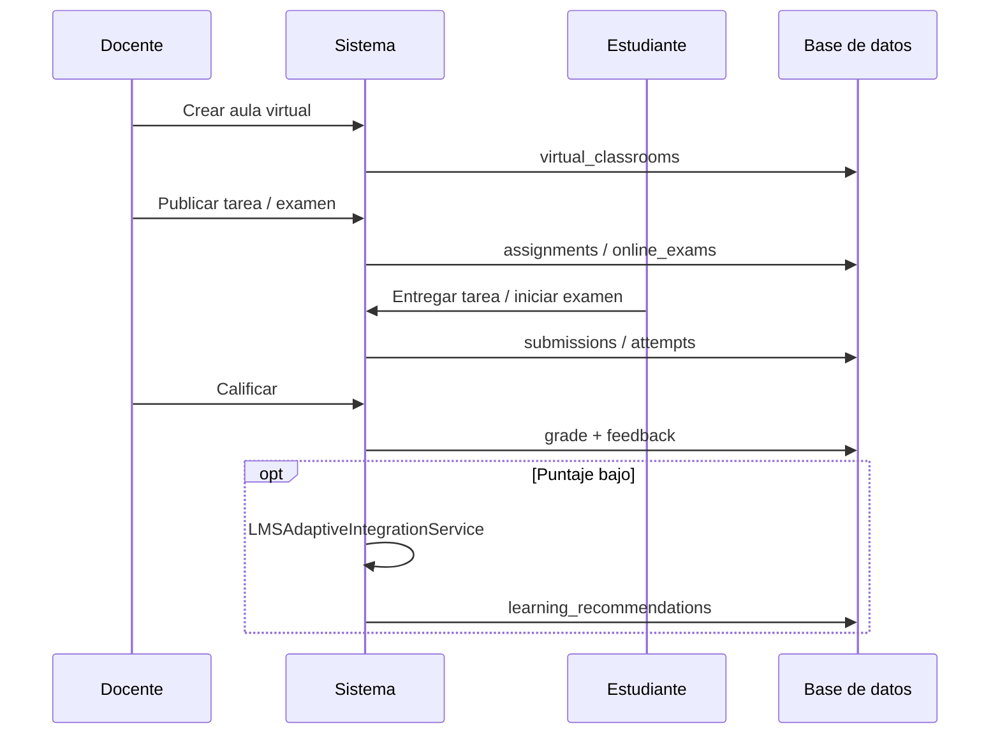

# Diagrama — Flujo LMS

```mermaid
sequenceDiagram
    participant D as Docente
    participant S as Sistema
    participant E as Estudiante
    participant DB as Base de datos

    D->>S: Crear aula virtual
    S->>DB: virtual_classrooms
    D->>S: Publicar tarea / examen
    S->>DB: assignments / online_exams
    E->>S: Entregar tarea / iniciar examen
    S->>DB: submissions / attempts
    D->>S: Calificar
    S->>DB: grade + feedback
    opt Puntaje bajo
        S->>S: LMSAdaptiveIntegrationService
        S->>DB: learning_recommendations
    end
```
