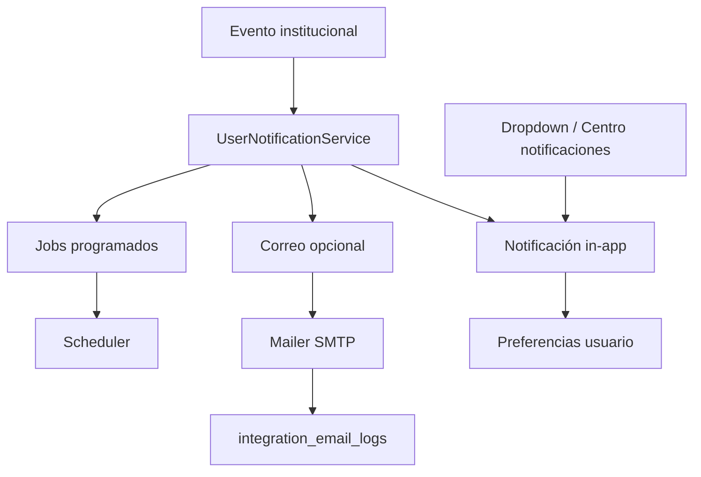

# Diagrama — Notificaciones

```mermaid
flowchart TD
    EVT[Evento institucional] --> UNS[UserNotificationService]
    UNS --> INAPP[Notificación in-app]
    UNS --> MAIL[Correo opcional]
    UNS --> JOB[Jobs programados]
    JOB --> SCH[Scheduler]
    INAPP --> PREF[Preferencias usuario]
    MAIL --> SMTP[Mailer SMTP]
    SMTP --> LOG[integration_email_logs]
    UI[Dropdown / Centro notificaciones] --> INAPP
```
