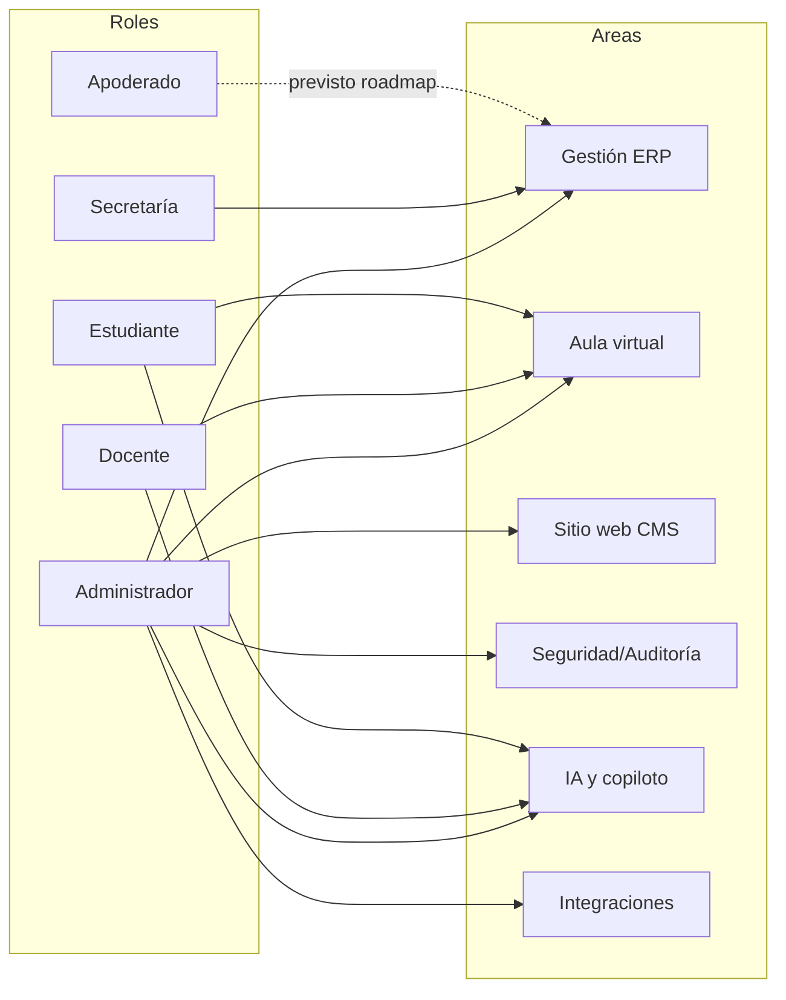

# Diagrama — Roles y acceso

```mermaid
flowchart LR
    subgraph Roles
        ADM[Administrador]
        SEC[Secretaría]
        DOC[Docente]
        EST[Estudiante]
        APO[Apoderado]
    end

    subgraph Areas
        ERP[Gestión ERP]
        LMS[Aula virtual]
        CMS[Sitio web CMS]
        SECP[Seguridad/Auditoría]
        AI[IA y copiloto]
        INT[Integraciones]
    end

    ADM --> ERP
    ADM --> LMS
    ADM --> CMS
    ADM --> SECP
    ADM --> AI
    ADM --> INT

    SEC --> ERP

    DOC --> LMS
    DOC --> AI

    EST --> LMS
    EST --> AI

    APO -.->|previsto roadmap| ERP
```

## Notas

- Middleware `role:` de Spatie en rutas.  
- Políticas finas por modelo (ej. docente solo sus aulas).
