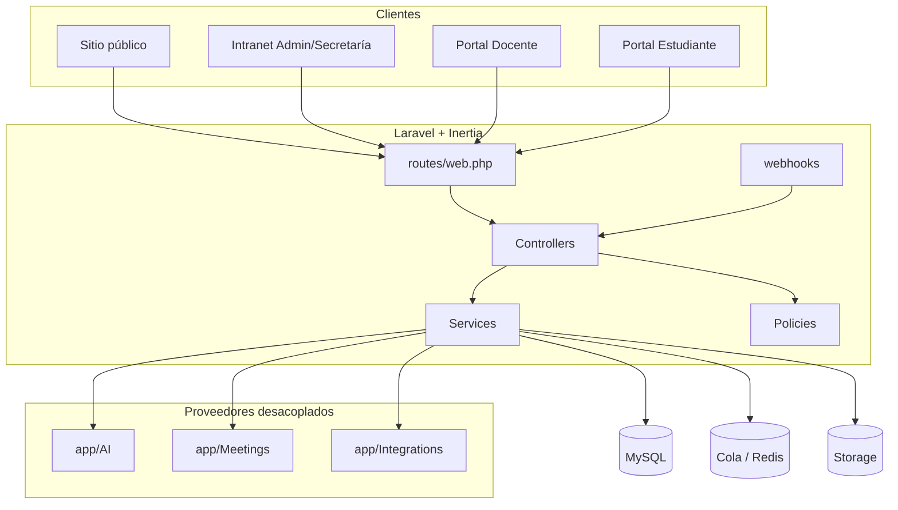

# Diagrama — Arquitectura general del sistema

## Descripción

Los cuatro canales de usuario convergen en una aplicación monolítica modular. Los proveedores externos se invocan solo desde servicios, nunca desde controladores directamente.
