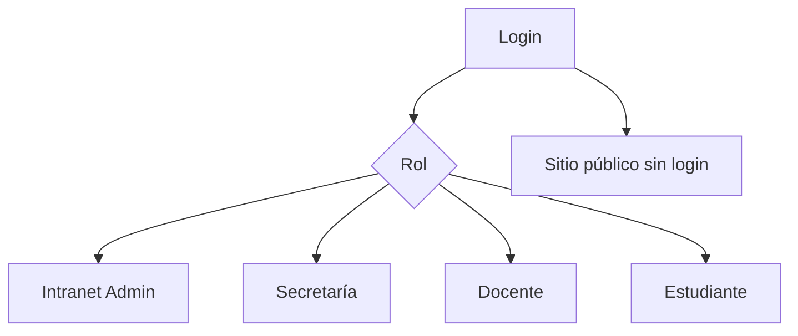

# Mockups — Visión general

## Propósito

Documentar la **experiencia de usuario esperada** por pantalla, para presentación académica, sin sustituir capturas reales.

## Convenciones

- Paleta institucional: navy (`#0f2744`), amarillo marca, fondos slate claros.  
- Componentes reutilizables: `AppCard`, `PageContainer`, `SectionTitle`, `Sidebar`.  
- Responsive: mobile-first en portales estudiante; tablas con scroll horizontal en admin.

## Índice de mockups

Ver archivos `*_MOCKUP.md` en esta carpeta y [SCREENSHOTS_GUIDE.md](../screenshots/SCREENSHOTS_GUIDE.md) para capturas PNG.

## Diagrama de navegación alto nivel

